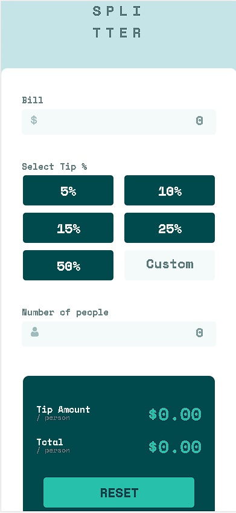
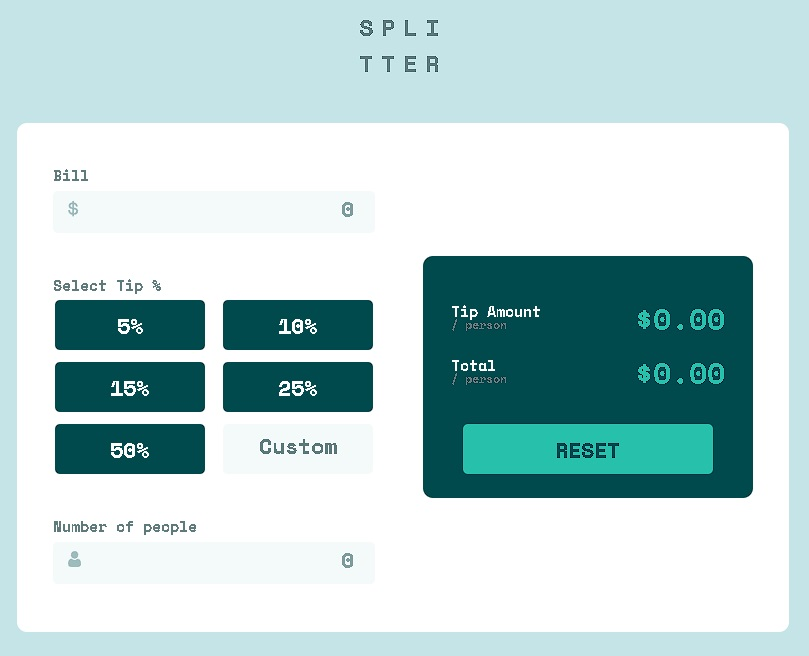

# Splitter-calculator
Uma calculadora que faz a divisão da conta e adiciona o valor da taxa de serviço/gorjeta.

## DETALHES DO PROJETO:
O objetivo deste projeto foi solucionar um problema que muitas vezes nos deparamos 
quando estamos em algum restaurante e vamos dividir a conta.
A Splitter-calculator foi desenvolvida com design simples e com uma lógica fácil de entender
para ajudar em qualquer lugar em que seja necessária!

## Disponível para desktop e mobile!
Este projeto foi desenvolvido com responsividade conseguindo se adequar tanto para telas
de mobile quanto para telas desktop.
Por ser uma ferramenta simples, o foco foi no desenvolvimento mobile, para o usuário
poder usar em qualquer lugar.

## Foto do Projeto para mobile

## Foto do Projeto para desktop

## TECNOLOGIAS USADAS NO PROJETO:
* HTML
* CSS
* JavaScript
